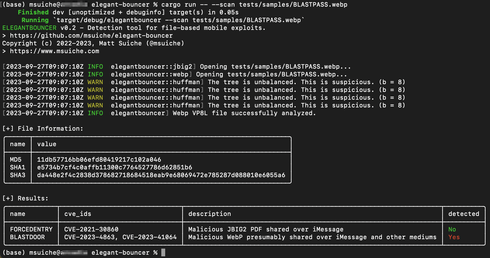

 

# ELEGANTBOUNCER
ELEGANTBOUNCER is a detection tool for file-based mobile exploits.

It employs an innovative approach for advanced file-based threat identification, eliminating the need for in-the-wild samples and outperforming traditional methods based on regular expressions or IOCs. At present, it primarily targets the identification of mobile vulnerabilities such as FORCEDENTRY (CVE-2021-30860) and BLASTPASS (CVE-2023-4863, CVE-2023-41064).

## Support Table
| Threat Name  | CVEs                            | Supported          |
|--------------|---------------------------------|--------------------|
| FORCEDENTRY  | CVE-2021-30860                  | :white_check_mark: |
| BLASTDOOR    | CVE-2023-4863, CVE-2023-41064   | :white_check_mark: |



### Learn more
- [FORCEDENTRY](documentation/FORCEDENTRY.md)
- [BLASTPASS](documentation/BLASTPASS.md)

## Getting started
```
elegant-bouncer v0.2
ELEGANTBOUNCER Detection Tool
Detection tool for file-based mobile exploits.

A utility designed to detect the presence of known mobile APTs in commonly distributed files.

Usage: elegant-bouncer [OPTIONS] <Input file>

Arguments:
  <Input file>
          Path to the input file

Options:
  -v, --verbose
          Print extra output while parsing

  -s, --scan
          Assess a given file, checking for known vulnerabilities

  -c, --create-forcedentry
          Create a FORCEDENTRY-like PDF

  -h, --help
          Print help information (use `-h` for a summary)

  -V, --version
          Print version information
```
### scan
Use `--scan` to assess a given file, checking for known vulnerabilities.

### create-forcedentry
Use `--create-forcedentry` to generate a PDF from the ground up designed to exploit CVE-2021-30860. Work in progress.

Note: Pre-made samples can be found in the [`samples/`](samples/) directory.

## Recommendations
Use [**Lockdown Mode**](https://support.apple.com/en-us/HT212650) to decrease your attack surface if you think you are a person of interest.

## Acknowledgements
- Apple Security Engineering and Architecture (SEAR)
- [Bill Marczack](https://twitter.com/@billmarczak)
- [Jeff](https://twitter.com/jeffssh/status/1474605696020881409) for helping me understand FORCEDENTRY
- [Valentina](https://twitter.com/chompie1337) for suggesting this target
- [Ian Beer](https://twitter.com/i41nbeer) and [Samuel Groß](https://twitter.com/5aelo) of Google Project Zero for their amazing write-up on the sample shared by Citizen Lab with them.
- [@mistymntncop](https://twitter.com/mistymntncop) for our exchanges and his work on [CVE-2023-4863](https://github.com/mistymntncop/CVE-2023-4863)
- [Ben Hawkes](https://blog.isosceles.com/the-webp-0day/)
