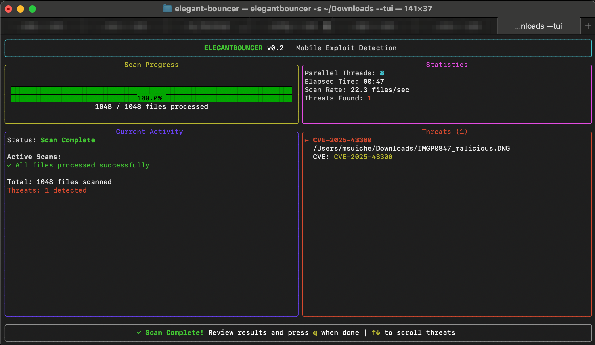

 

# ELEGANTBOUNCER
ELEGANTBOUNCER is a detection tool for file-based mobile exploits.

It employs an innovative approach for advanced file-based threat identification, eliminating the need for in-the-wild samples and outperforming traditional methods based on regular expressions or IOCs. At present, it primarily targets the identification of mobile vulnerabilities such as FORCEDENTRY (CVE-2021-30860), BLASTPASS (CVE-2023-4863, CVE-2023-41064), and TRIANGULATION (CVE-2023-41990).

## Support Table
| Threat Name    | CVEs                            | Supported          |
|----------------|---------------------------------|--------------------|
| FORCEDENTRY    | CVE-2021-30860                  | :white_check_mark: |
| BLASTDOOR      | CVE-2023-4863, CVE-2023-41064   | :white_check_mark: |
| TRIANGULATION  | CVE-2023-41990                  | :white_check_mark: |
| CVE-2025-43300 | CVE-2025-43300                  | :white_check_mark: |


### Learn more
- [FORCEDENTRY](documentation/FORCEDENTRY.md)
- [BLASTPASS](documentation/BLASTPASS.md)

## Terminal User Interface



The TUI mode provides real-time visualization of parallel scanning operations, showing all active worker threads simultaneously. Enable it with the `--tui` flag when scanning directories.

## Getting started
```
elegant-bouncer v0.2
ELEGANTBOUNCER Detection Tool
Detection tool for file-based mobile exploits.

A utility designed to detect the presence of known mobile APTs in commonly distributed files.

Usage: elegant-bouncer [OPTIONS] <Input path>

Arguments:
  <Input path>
          Path to the input file or folder

Options:
  -v, --verbose
          Print extra output while parsing

  -s, --scan
          Assess a given file or folder, checking for known vulnerabilities

  -c, --create-forcedentry
          Create a FORCEDENTRY-like PDF

  -r, --recursive
          Recursively scan subfolders

  -m, --messaging
          Scan messaging app databases for attachments (iOS backup format)

  --ios-extract
          Extract/reconstruct iOS backup to readable folder structure

  -o, --output <OUTPUT>
          Output directory for iOS backup extraction

  -f, --force
          Force overwrite of output directory if not empty

  -e, --extensions <EXTENSIONS>
          File extensions to scan (comma-separated, e.g., "pdf,webp,ttf")
          Default: pdf,gif,webp,jpg,jpeg,png,tif,tiff,dng,ttf,otf

  -h, --help
          Print help information (use `-h` for a summary)

  -V, --version
          Print version information
```

### Scanning Files and Folders

#### Single File Scan
Use `--scan` to assess a single file for known vulnerabilities:
```bash
elegantbouncer --scan suspicious_file.pdf
```

#### Folder Scan
Scan all supported files in a directory:
```bash
elegantbouncer --scan /path/to/folder
```

#### Recursive Folder Scan
Use `-r` flag to recursively scan all subdirectories:
```bash
elegantbouncer --scan /path/to/folder -r
```

#### Custom File Extensions
Specify which file types to scan using the `-e` flag:
```bash
# Scan only PDF and DNG files
elegantbouncer --scan /path/to/folder -e pdf,dng

# Scan only image files recursively
elegantbouncer --scan /path/to/folder -r -e jpg,jpeg,png,webp,gif
```

#### Default Extensions
By default, the tool scans files with these extensions:
- **Documents**: pdf
- **Images**: gif, webp, jpg, jpeg, png, tif, tiff, dng
- **Fonts**: ttf, otf

### Example Output

When scanning a directory, the tool provides:
- Real-time progress updates
- Immediate threat detection notifications
- Summary table with all vulnerability types
- Detailed infected files table with:
  - File path
  - Threat name
  - Associated CVE IDs

```
[+] Scanning directory: /path/to/documents
[+] Recursive mode enabled
[+] Extensions: pdf, gif, webp, jpg, jpeg, png, tif, tiff, dng, ttf, otf

[1] Scanning: /path/to/documents/invoice.pdf
[2] Scanning: /path/to/documents/photo.jpg
[3] Scanning: /path/to/documents/malicious.webp
  └─ THREAT found: BLASTPASS
[4] Scanning: /path/to/documents/report.pdf
  └─ THREAT found: FORCEDENTRY

[+] Scanned 4 files

[+] Summary Results:
╭────────────────┬───────────────────────────────┬──────────────────────────────────────────────────────────────────────────┬──────────╮
│ name           │ cve_ids                       │ description                                                              │ detected │
├────────────────┼───────────────────────────────┼──────────────────────────────────────────────────────────────────────────┼──────────┤
│ FORCEDENTRY    │ CVE-2021-30860                │ Malicious JBIG2 PDF shared over iMessage                                 │ Yes      │
│ BLASTDOOR      │ CVE-2023-4863, CVE-2023-41064 │ Malicious WebP presumably shared over iMessage and other mediums         │ Yes      │
│ TRIANGULATION  │ CVE-2023-41990                │ Maliciously crafted TrueType font embedded in PDFs shared over iMessage  │ No       │
│ CVE-2025-43300 │ CVE-2025-43300                │ Malicious DNG with JPEG Lossless compression exploiting RawCamera.bundle │ No       │
╰────────────────┴───────────────────────────────┴──────────────────────────────────────────────────────────────────────────┴──────────╯

[!] Infected Files Details:
╭────────────────────────────────┬─────────────┬───────────────────────────────╮
│ path                           │ threat_name │ cve_ids                       │
├────────────────────────────────┼─────────────┼───────────────────────────────┤
│ /path/to/documents/report.pdf  │ FORCEDENTRY │ CVE-2021-30860                │
│ /path/to/documents/malicious.webp │ BLASTPASS   │ CVE-2023-4863, CVE-2023-41064 │
╰────────────────────────────────┴─────────────┴───────────────────────────────╯
```

### iOS Backup Analysis

#### Extract iOS Backup Structure
Reconstruct an iOS backup to its readable folder structure:
```bash
# Extract backup to default location (creates _reconstructed folder)
elegantbouncer --ios-extract /path/to/ios/backup

# Extract to specific output directory
elegantbouncer --ios-extract /path/to/ios/backup -o /path/to/output

# Force overwrite if output directory exists
elegantbouncer --ios-extract /path/to/ios/backup -o /path/to/output --force
```

#### Scan Messaging App Attachments
Scan iOS backup for malicious attachments in messaging apps:
```bash
# Scan messaging databases (iMessage, WhatsApp, Viber, Signal, Telegram)
elegantbouncer --scan --messaging /path/to/ios/backup

# Combine with extraction for complete analysis
elegantbouncer --ios-extract /path/to/ios/backup -o /tmp/extracted
elegantbouncer --scan --messaging /tmp/extracted
```

This feature detects threats in attachments from:
- **iMessage** - SMS/MMS database attachments
- **WhatsApp** - Media files from chats
- **Viber** - Shared files and media
- **Signal** - Attachments folder (database is encrypted)
- **Telegram** - Cached media files

### create-forcedentry
Use `--create-forcedentry` to generate a PDF from the ground up designed to exploit CVE-2021-30860. Work in progress.

Note: Pre-made samples can be found in the [`samples/`](tests/samples/) directory.

## Recommendations
Use [**Lockdown Mode**](https://support.apple.com/en-us/HT212650) to decrease your attack surface if you think you are a person of interest.

## Acknowledgements
- [Hamid K. (@Hamid-K)](https://github.com/Hamid-K) for the original implementation of messaging app scanning and iOS backup reconstruction
- [Valentin Pashkov, Mikhail Vinogradov, Georgy Kucherin (@kucher1n), Leonid Bezvershenko (@bzvr_), and Boris Larin (@oct0xor) of Kaspersky](https://securelist.com/operation-triangulation-the-last-hardware-mystery/111669/)
- [Apple Security Engineering and Architecture (SEAR)](https://bugs.chromium.org/p/chromium/issues/detail?id=1479274)
- [Bill Marczack](https://twitter.com/@billmarczak)
- [Jeff](https://twitter.com/jeffssh/status/1474605696020881409) for helping me understand FORCEDENTRY
- [Valentina](https://twitter.com/chompie1337) for suggesting this target
- [Ian Beer](https://twitter.com/i41nbeer) and [Samuel Groß](https://twitter.com/5aelo) of Google Project Zero for their amazing write-up on the sample shared by Citizen Lab with them.
- [@mistymntncop](https://twitter.com/mistymntncop) for our exchanges and his work on [CVE-2023-4863](https://github.com/mistymntncop/CVE-2023-4863)
- [Ben Hawkes](https://blog.isosceles.com/the-webp-0day/)

## References
- [Detecting CVE-2025-43300: A Deep Dive into Apple's DNG Processing Vulnerability](https://www.msuiche.com/posts/detecting-cve-2025-43300-a-deep-dive-into-apples-dng-processing-vulnerability/)
- [Researching Triangulation: Detecting CVE-2023-41990 with single byte signatures.](https://www.msuiche.com/posts/researching-triangulation-detecting-cve-2023-41990-with-single-byte-signatures./)
- [Researching FORCEDENTRY: Detecting the Exploit With No Samples](https://www.msuiche.com/posts/researching-forcedentry-detecting-the-exploit-with-no-samples/)
- [Researching BLASTPASS: Detecting the exploit inside a WebP file - Part 1](https://www.msuiche.com/posts/researching-blastpass-detecting-the-exploit-inside-a-webp-file-part-1/)
- [Researching BLASTPASS: Analysing the Apple & Google WebP POC file - Part 2](https://www.msuiche.com/posts/researching-blastpass-analysing-the-apple-google-webp-poc-file-part-2/)